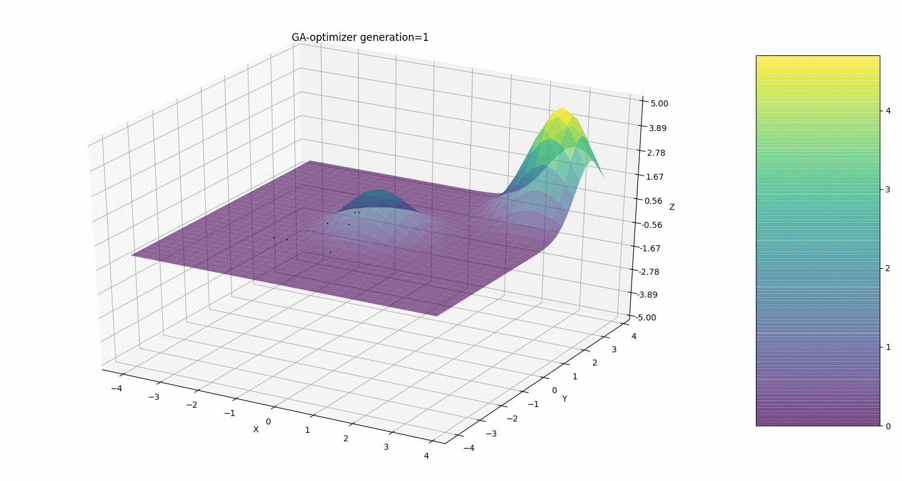

# Maksymum Minimum Funkcji poprzez Algorytm genetyczny
## Optymalizacja funkcji oparta na algorytmach genetycznych

### Uruchomienie:
** mpiexec -n 4 python script.py main.py aby uruchomić ten program i otworzyć GUI

Program ten w przybliżeniu oblicza minimum lub maksimum funkcji o dwóch parametrach na podstawie algorytmu genetycznego.  
Każdy osobnik ma jeden chromosom (x, y) i ze względu na to, że osobnik i chromosom mają to samo znaczenie, pokolenie składa się z części, gdzie jedna część to 4 osobniki, w konsekwencji liczba chromosomów jest wielokrotnością 4.  

Zasada crossover to:  

(x_better, y_best), (y_better, y_best), (x_best, y_better), (x_best, y_good)  

gdzie (x_best, y_best), (x_better, y_better), (x_good, y_good) są zaznaczonymi individs.

Mutacja może być wybrana losowo w dowolnym Genie (można ją skonfigurować w metodzie startGA_with_statistics).  
Wypełnienie z pokolenia zerowego losowymi liczbami zmiennoprzecinkowymi w [-chromosomes_number / 2, chromosomes_number).  
Wyniki są wyświetlane na ekranie, a także zapisywane w ' Ga-statistics.txt".  

https://pl.wikipedia.org/wiki/Algorytm_genetyczny
https://www.tutorialspoint.com/genetic_algorithms/genetic_algorithms_crossover.html
https://www.sciencedirect.com/science/article/pii/S0045794900000894
https://www.geeksforgeeks.org/crossover-in-genetic-algorithm/

### Jak korzystać   

uruchomić ten program i otworzyć ustawienia-GUI z kilkoma polami:    
- f(x, y) input string  
- chromosomes   
- generations number input string liczba pokoleń  
- optimizer function (min or max) funkcja optymalizatora (min lub max)  

Oraz pola z ptaszkami (funkcjonalne):  

- mutation - dodanie mutacji do każdej części (4 osobników) nowego pokolenia  
- show statistics - pokazuje dokładne informacje o każdym pokoleniu  
- save all files - zapisuje do folderu results statystyki wyników z animacją w .gif oraz ga-statystyki + do folderu generations dane csv z kolumnami x, y, f (x, y)  
- show plot - pokazuje animację ewaluacji  

MPI:  
- https://www.mn.uio.no/astro/english/services/it/help/programming/mpi-linux-clusters.html  
- https://software.intel.com/en-us/forums/intel-clusters-and-hpc-technology/topic/289516  
- https://rabernat.github.io/research_computing/parallel-programming-with-mpi-for-python.html
- https://www.youtube.com/watch?v=36nCgG40DJo
- http://prac.im.pwr.wroc.pl/~szwabin/assets/diff/7.pdf strona 9
- https://stackoverflow.com/questions/17054469/parallel-application-in-python-becomes-much-slower-when-using-mpi-rather-than-mu ???

